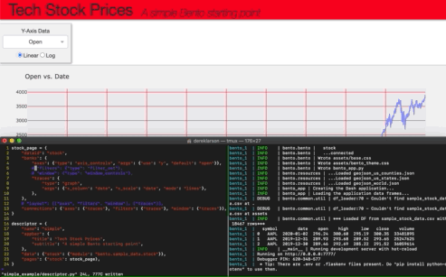

# Bento

### *Create Plotly Dash apps via templates*
|  | This GIF shows the ideal Bento experience, how you can add components to a dashboard in real time. Adding two extra controls, fixing up the layout, and finally applying a dark theme were all simple, drop-in changes. |
|-|:-|

Bento is a templating engine built on [Plotly Dash](https://plotly.com/dash/). It lets you
write a high-level description of your desired interactive dashboard and generates
the application code for you. Like its [namesake](https://en.wikipedia.org/wiki/Bento),
Bento focuses on convenience and organization.  By providing a set of reusable
building blocks and abstracting away some of the more complicated aspects, it
aims to flatten the learning curve of dashboarding!

## Features
 * Write 10x fewer lines of code for your app
 * Easily control the dashboard layout via a grid system
 * Leverage a library of pre-built compound objects (Bento's 'banks')
 * CSS-free experience -- simple theming and styling support, CSS is templated away
 * Out-of-the-box support for multi-page dashboards with an appbar
 * Manage deployments with [Bento Builder](https://github.com/dereklarson/bento_builder)
 * Encourage good coding practices, decoupling data prep and visualization

## Gallery
For some example dashboards, I've put together a
[small gallery](https://github.com/dereklarson/bento_gallery). 
You can click through the live examples linked in the readme and compare to the 
descriptors located in each of the associated folders in the repo.

## Quickstart
Dependencies: Python 3.7+

Bento is available on PyPI, and the latest version can be installed with:

`pip3 install bento-dash`

To make sure everything is working, try running the demo app:

`bento-demo`

And navigate in your browser to `localhost:8050`.

## Developing with Bento
If you're interested in creating and deploying a Bento dashboard, I recommend setting
up a Docker-friendly environment. I created a repo that can get you going called
[Bento Builder](https://github.com/dereklarson/bento_builder). Some extra details are
provided in the Bento Builder readme.

## Contributing to Bento
As an early stage product, honest and direct feedback is extremely valuable.
Don't hesitate to open an issue with suggestions until another forum is set up.
