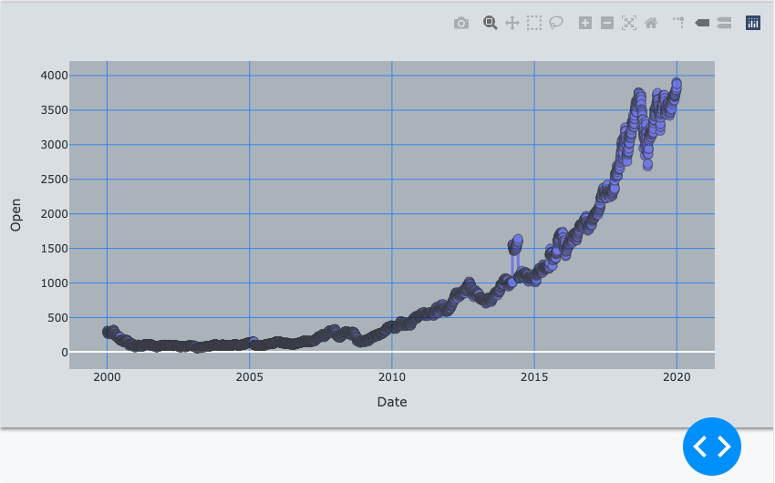
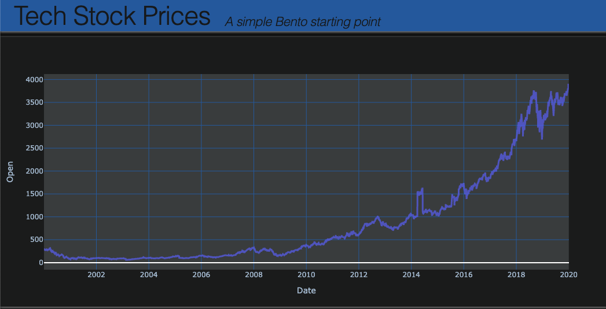

Beginner Tutorial
==================

This is intended as a fast, but not too furious, introduction to the Bento system.
You're going build a functional, interactive dashboard in a matter of minutes. Not to
worry, you will be handed all of the pieces you need with instructions on where they go
and a brief explanation of how the pieces fit. And, each step will give a visual result
which you can check against some of the checkpoint images. The goal is to convey the
fundamentals of the system without going into details.

As a straightforward example, let's build a dashboard that visualizes historical stock
prices for a few large tech companies. As perhaps one of the most commonly experienced
chart types in the world, most people should have some idea of what to expect here. You
can see what we're gonna end up with by running ``$ bento-demo`` and clicking to the
stock page on the app bar.

We can break this project up into four stages:
 - Plan the basic features
 - Prepare the data we are using
 - Set up our Bento dev environment
 - Write the descriptor (which we'll break out into pieces)

.. note::
    For the foreseeable future (how long is that, really?), only 'Nix environments
    are gonna be supported (namely Mac and Linux) so we'll take some liberties in
    assuming that.

Features
--------

What should our dashboard do? It's a tough question if you are trying to predict the end
product--there are a lot of unknowns (Who is the target user?  What interactions will
work well? Will the dashboard get cluttered? What does Bento even support doing?) so let's just
try to start with a good first draft.  We'd like to at least be able to plot comparative
traces of stock gains. For this, we'll need the ability to select the ticker symbols to
show. A way to choose a period in time for comparison would also be useful. Lastly, we
would also need a way to normalize the prices into percentage gains from the start of
our interval.

This translates into 4 total Bento banks:
 - A ``selector`` -- a multi-selection dropdown tied stock ticker symbols
 - A ``date_slider`` -- a two-sided slider bar, letting choose a date interval
 - An ``analytics_set`` -- a toolkit that contains a normalization option
 - Lastly, a standard ``graph`` for the plotting of the time series

Data
----

Bento leaves the data preparation to the user, by design. But for this example, we will
simply use the sample stock dataset packaged with Bento (I suppose it is a stock stock
dataset...apologies). Not only is this data prepared, but it is also supplied in the
expected structure:

.. code-block:: python

    {
        "df": your_dataframe_object,
        "keys": ["key_column_1", "key_column_2"],
        "types": {"measurement_column_1": int}
    }

The structure above contains the data as a Pandas DataFrame and adds descriptive info:
identifying the columns that are keys (which help locate rows of interest) and
for those that contain metrics with their types (usually date, float, int). The metadata
helps Bento supply automated defaults, helping ensure your app works right away.
For example, sample stock data metadata looks something like

.. code-block:: python

    {
        "df": <the DataFrame object>,
        "keys": ["symbol"],
        "types": {"open": float, "close": float, "volume": int}
    }

Can you guess how Bento incorporates this? 

.. note::
    Exploring a sample dataset is straightforward, for example try:

    >>> from bento.sample_data import stock
    >>> dataset = stock.load()
    >>> print(dataset['df'])

Ultimately, Bento requires a module that can be imported to load the data. So in
this case that is ``bento.sample_data.stock``, which we'll use shortly!

Environment
-----------
  
Now that you're palpably excited from visualizing the dashboard, it's best to channel some
of that energy into setting up your development environment. This will save a lot of
time and headache down the road. I recommend going through the Quickstart steps
at the `Bento Builder <https://github.com/dereklarson/bento_builder>`_ repo.
Make sure ``$ ./build.py simple_example -dbu`` works, because we'll be using the
same flags.

Once that is done, make a new directory called beginner and open a new file
``descriptor.py`` for editing in your favorite editor:

.. code-block:: bash

    $ mkdir beginner
    $ vi beginner/descriptor.py

.. note::
    If you want some extra credit, add a version file to avoid a later warning

    $ echo '__version__ = "0.0.1"' > beginner/_version.py

Descriptor
----------

And now for the main course, let's write the Bento descriptor. This is the piece that
really ties the room together.

Step 1
^^^^^^

We're going to start with the most basic, functional
skeleton to start. This entails declaring the data source (the stock sample data, as above)
and defines a single page containing a single bank (of type "graph"). 

.. code-block:: python

    # beginner/descriptor.py
    descriptor = {
        "data": {"stock": {"module": "bento.sample_data.stock"}},
        "pages": {"main_page": {"dataid": "stock", "banks": {"traces": {"type": "graph"}}}}
    }

This should get us a graph that displays our DataFrame blindly. Go ahead and paste that
into the descriptor file. Now you can run the build script:

.. code-block:: bash

    $ ./build.py beginner -dbu

And if all is good, you can go to localhost:7777 and see something (ugly) like this:

Don't worry, this will clean up pretty quick. 

So here's what's important to know about what we did:
 - We named the key in ``data``  something unique and relevant ("stock")
 - The key matches the value of the ``dataid`` for our page
 - The ``module`` for our data entry is set to the sample data
 - Our page has a ``banks`` key with a valid dictionary of our single bank
 - The ``main_page`` and ``traces`` strings just represent unique names we can make up

Step 2
^^^^^^

Let's add a few quick aesthetic improvements:
 - Add an ``appbar`` to the descriptor, which sets a title/subtitle and contains any nav links 
 - Change the theme to ``dark``
 - Set the graph trace mode to lines
 - Also let's break out the page definition from the main dictionary

Try them in any order by looking at the completed version below:

.. code-block:: python

    # beginner/descriptor.py
    main_page = {
        "dataid": "stock",
        "banks": {
            "traces": {"type": "graph", "args": {"mode": "lines"}},
        },
    }

    descriptor = {
        "name": "beginner_tutorial",
        "theme": "dark",
        "appbar": {
            "title": "Tech Stock Prices",
            "subtitle": "A simple Bento starting point",
        },
        "data": {"stock": {"module": "bento.sample_data.stock"}},
        "pages": {"main": main_page},
    }

Step 3
^^^^^^

Now let's start cooking with gas. First, we'll add all the banks we had planned. Simply
add these lines to the ``banks`` dict:

.. code-block:: python

    "analytics": {"type": "analytics_set"},
    "symbols": {"type": "selector", "args": {"columns": ["symbol"]}},

You should now get some new blocks showing up, but they aren't very well-organized. As in,
they are just stacked on top of each other, rather lazily. We can fix that by supplying
a layout. This should be intuitive, just add this to the page dict and see if it makes sense:

.. code-block:: python

    "layout": [["symbols", "analytics"], ["traces"]],

Currently, Bento expects a 2-D array of bank IDs, but a generalization to N-D could be
in the cards.

Perhaps you're also frustrated that these don't `do` anything yet. That's because we haven't
told the app to connect the banks. This part is, I think, delightfully straightforward--just
define the many-to-many graph of connections between banks. In this case, it's just the
following new dictionary keyed into the page:

.. code-block:: python

    "connections": {
        "symbols": {"traces"},
        "analytics": {"traces"},
    },

Now stuff should happen. And there was much rejoicing.

